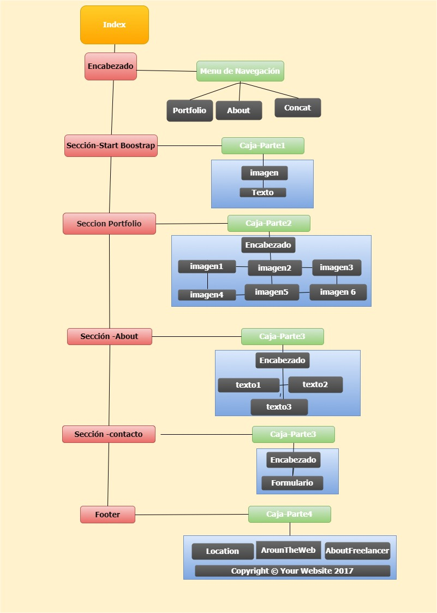

# Freelancer

* **Curso:** _Creando tu primer sitio web interactivo_
* **Unidad:** _Maquetado web con HTML & CSS_

***

Para completar este reto, hemos creado este repositorio boilerplate (plantilla
inicial) con todos los recursos que necesitas. Esto incluye imágenes y
estructura de carpetas y archivos donde colocarás tu código.

## Objetivo
En el siguiente proyecto se nos pide replicar el sitio **Freelancer**:

## Estructura del Sitio Web Freelancer
- La siguiente imagen representa la estructura visual de la página index.html , y el orden en que el usuario verá el contenido.

## Estructura de archivos
- Dentro del proyecto  encontramos  el archivo `index.html` y 2 carpetas: assets y css
- La carpeta `assets` tiene contenido los recursos a utilizar para nuestro sitio web(imagenes, iconos,etc)
- En la carpeta `css` se tiene un archivo base `main.css` que sera la hoja de estilos a utilar para nuestro proyecto
## Observaciones

* Esta web utiliza 2 tipografías: `Montserrat` y `Lato`.
* Los íconos de redes sociales fuerón obtenidos de [Font Awesome](http://fontawesome.io/).

* Puede ver el [Proyecto en vivo](https://jennifercarmen.github.io/freelancerSp2/)
## Creditos
* Jennifer Milagros Carmen Sosa
